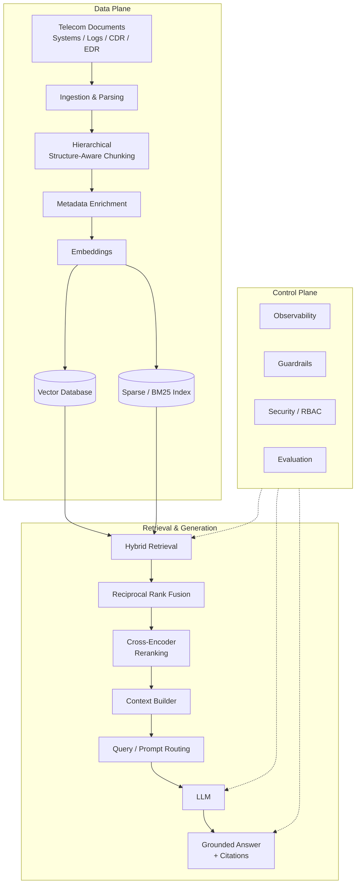

# 🚀 Enterprise RAG Engineering Lab

## Building a Telecom-Grade AIOps RAG Platform

> **From raw RAG mechanics to an enterprise-grade Retrieval-Augmented Generation platform for telecom operations, BSS/OSS, NOC/SRE workflows, and AIOps.**

---

## 📌 Project Overview

This project is an **engineering laboratory for learning and building Advanced RAG systems from first principles**.

The goal is not simply to build a chatbot using LangChain or another framework.

Instead, we progressively implement and understand the underlying mechanics:

**Documents → Parsing → Chunking → Metadata → Embeddings → Retrieval → Reranking → Context Engineering → LLM → Grounded Response → Agents → MCP → Kubernetes → AIOps**

The final platform is designed around real-world telecommunications requirements such as:

* BSS / OSS operational documentation
* Network and application troubleshooting
* Error-code investigation
* SOP and runbook retrieval
* Vendor documentation
* CDR / EDR operational analysis
* Application and infrastructure logs
* Kubernetes troubleshooting
* Production incident investigation
* AIOps-assisted operations

---

# 🎯 Project Objectives

### Primary Objective

Build a production-oriented RAG platform capable of providing **grounded, traceable, secure, and operationally useful answers** for telecom engineering teams.

### Learning Objectives

This project is also a structured learning path covering:

* RAG fundamentals
* Information retrieval
* Embeddings
* Vector databases
* Sparse retrieval
* Hybrid search
* Reranking
* Query transformation
* Context engineering
* LLM grounding
* RAG evaluation
* Enterprise security
* Event-driven ingestion
* FastAPI
* Observability
* Agentic RAG
* MCP
* Kubernetes
* GitOps
* AIOps

---

# 🧠 Core Engineering Principle

> **Understand the mechanism before using the abstraction.**

The project intentionally avoids jumping directly into high-level frameworks.

For example:

```text
Understand cosine similarity
        ↓
Implement vector retrieval
        ↓
Understand metadata filtering
        ↓
Implement hybrid retrieval
        ↓
Understand reranking
        ↓
Implement cross-encoder reranking
        ↓
Only then introduce higher-level frameworks
```

Frameworks such as LangChain and LangGraph will be introduced **after the underlying concepts are understood**.

---

# 🏗️ Target Architecture

The final system separates the platform into a **Data Plane** and **Control Plane**.



---

# 📡 Telecom-Specific Design Requirements

Generic RAG systems are not sufficient for many telecom operational environments.

This platform is designed around several important requirements.

## 1. Exact-Match Retrieval

Operational systems frequently contain identifiers such as:

```text
ORA-00942
HTTP 500
SVC-1024
3GPP TS 38.331
HTTP-503
ERR_BSS_1042
```

Pure semantic retrieval may not reliably prioritize these exact identifiers.

Therefore the platform uses:

```text
Dense Retrieval
      +
Sparse / BM25 Retrieval
      ↓
Hybrid Search
```

---

## 2. Structure-Aware Documents

Telecom documentation commonly contains:

* Tables
* Procedures
* Configuration parameters
* Hierarchical headings
* Error codes
* Command examples
* Architecture diagrams
* Vendor-specific terminology
* Nested sections

The ingestion pipeline therefore evolves from naive chunking into:

```text
Document
   ↓
Section
   ↓
Subsection
   ↓
Paragraph / Table / Procedure
   ↓
Semantic Chunk
```

---

## 3. Strict Grounding

Operational AI should not invent commands, configurations, or troubleshooting procedures.

The platform therefore implements:

```text
Retrieve
   ↓
Validate Evidence
   ↓
Generate
   ↓
Verify Grounding
   ↓
Return Answer
```

If sufficient evidence cannot be retrieved:

```text
Information not found in the knowledge base.
```

The system should prefer **abstention over unsupported operational instructions**.

---

# 🔐 Enterprise Security

Security is treated as a first-class architecture concern.

The target platform supports:

* Authentication
* RBAC
* Document-level ACLs
* Tenant isolation
* Metadata-based access filtering
* Secure API access
* Audit logging

Example:

```text
User
 ↓
Authentication
 ↓
Role / Permissions
 ↓
Allowed Documents
 ↓
Metadata Filter
 ↓
Retrieval
 ↓
LLM
```

A user should never retrieve a document simply because it is semantically relevant if they are not authorized to access it.

---

# 🖥️ Dual Response Modes

The platform provides two operational modes.

| Capability              | Direct Source Mode               | Generative AI Mode                          |
| ----------------------- | -------------------------------- | ------------------------------------------- |
| Primary purpose         | Exact factual retrieval          | Reasoning & synthesis                       |
| LLM usage               | Minimal / extraction-focused     | Full generation                             |
| Hallucination tolerance | Extremely low                    | Controlled through grounding                |
| Response                | Source-grounded extraction       | Synthesized answer                          |
| Citations               | Required                         | Required                                    |
| Best suited for         | Error codes, configs, SOP lookup | Summaries, analysis, guided troubleshooting |

### Example

A NOC engineer searches:

```text
What does ORA-00942 mean?
```

### Direct Source Mode

Returns the relevant source passage and document location.

### Generative Mode

Can provide:

```text
Meaning
Possible causes
Relevant troubleshooting procedure
Required checks
Source references
```

while remaining grounded in retrieved evidence.

---

# 📖 Automated Source View

The intended operational UI provides a split-screen workflow.

```text
┌─────────────────────────────┬──────────────────────────────┐
│                             │                              │
│        AI Assistant         │       Source Document        │
│                             │                              │
│  User Query                 │       PDF / Document         │
│                             │                              │
│  Grounded Answer            │       Exact Page             │
│                             │                              │
│  Citations                  │       Highlighted Chunk      │
│                             │                              │
└─────────────────────────────┴──────────────────────────────┘
```

The system should automatically:

1. Identify the source document.
2. Identify the relevant chunk.
3. Resolve the page number.
4. Open the document.
5. Navigate to the relevant page.
6. Highlight or emphasize the relevant passage.

---

# 🛣️ Engineering Roadmap

The project is divided into **17 progressive phases**.

---

## Phase 1 — Baseline RAG Deconstruction

Understand the existing implementation before changing it.

Topics:

* `loaders.py`
* `vectorstore.py`
* `rag_pipeline.py`
* `main.py`
* `app.py`
* Document loading
* Text splitting
* Embedding generation
* FAISS
* Similarity search
* Prompt construction
* LLM invocation

### Deliverable

A documented baseline architecture and data flow.

---

## Phase 2 — Structure-Aware Chunking

Move beyond naive character-based splitting.

Topics:

* Recursive splitting
* Semantic chunking
* Parent-child chunks
* Hierarchical retrieval
* Heading-aware chunking
* Table-aware parsing
* Chunk metadata
* Chunk overlap
* Chunk-size tradeoffs

### Deliverable

A telecom-aware hierarchical chunking pipeline.

---

## Phase 3 — Embeddings

Understand embeddings mathematically and operationally.

Topics:

* Vector representations
* Embedding models
* Dimensions
* Cosine similarity
* Dot product
* Euclidean distance
* Normalization
* Similarity search
* Embedding quality
* Domain-specific embeddings

### Deliverable

A configurable embedding pipeline with retrieval experiments.

---

## Phase 4 — Vector Databases

Move beyond a local FAISS prototype.

Target technologies:

* FAISS
* Qdrant
* pgvector

Topics:

* Collections
* Payload / metadata
* Filtering
* Indexing
* Persistence
* Approximate nearest-neighbor search
* Scaling considerations

### Deliverable

Production-oriented vector retrieval with metadata filtering.

---

## Phase 5 — Hybrid Retrieval

Combine:

```text
Dense Retrieval
      +
Sparse Retrieval
      ↓
Hybrid Retrieval
```

Technologies:

* BM25
* Vector search
* Reciprocal Rank Fusion
* Exact-match retrieval

### Deliverable

A hybrid retriever capable of handling both semantic questions and exact telecom identifiers.

---

## Phase 6 — Precision Reranking

Initial retrieval may produce:

```text
Top 50 candidates
```

A cross-encoder reranker then evaluates them and produces:

```text
Top 5 high-quality passages
```

Topics:

* Bi-encoders
* Cross-encoders
* Query-document scoring
* Reranking
* Precision / recall tradeoffs
* Latency optimization

---

# 🧠 Enterprise Intelligence

## Phase 7 — Query Transformation

Improve difficult queries before retrieval.

Topics:

* Query rewriting
* Query expansion
* Multi-query retrieval
* Intent detection
* Query decomposition
* Error-code extraction
* Entity extraction
* Query routing

Example:

```text
User:
"My billing application is failing with ORA-00942"

        ↓

Intent:
Database / Application Error

        ↓

Entities:
ORA-00942
Billing

        ↓

Retrieval Strategy:
Exact Match + BM25 + Dense Search
```

---

## Phase 8 — Context Engineering

Retrieved documents must be transformed into an efficient context.

Topics:

* Deduplication
* Context compression
* Ordering
* Token budgeting
* Context prioritization
* Lost-in-the-middle problem
* Parent-child context reconstruction
* Source attribution

---

## Phase 9 — Grounding & Guardrails

Implement strict grounding policies.

Example:

```text
Question
   ↓
Retrieve Evidence
   ↓
Evidence Validation
   ↓
Enough Evidence?
   ├── No → Abstain
   │
   └── Yes
        ↓
      Generate
        ↓
   Grounding Check
        ↓
      Answer
```

Capabilities:

* Citation enforcement
* Evidence thresholds
* Abstention
* Unsupported-claim detection
* Prompt injection defenses
* Output validation

---

# 📊 Phase 10 — Evaluation as Engineering

RAG quality must be measurable.

Metrics include:

### Retrieval

* Precision@K
* Recall@K
* MRR
* NDCG

### Generation

* Faithfulness
* Answer relevancy
* Context relevancy
* Citation accuracy

### System

* Retrieval latency
* Reranking latency
* LLM latency
* End-to-end latency
* Token consumption
* Cost

Example evaluation pipeline:

```text
Dataset
   ↓
Queries
   ↓
Retriever
   ↓
Top-K Documents
   ↓
Reranker
   ↓
LLM
   ↓
Evaluation
   ↓
Metrics
   ↓
Regression Report
```

---

# 🔒 Phase 11 — Enterprise Security

Implement:

```text
Authentication
      ↓
Authorization
      ↓
RBAC
      ↓
Document ACL
      ↓
Tenant Isolation
      ↓
Filtered Retrieval
```

Example roles:

```text
L1 Support
L2 Support
NOC Engineer
SRE
Administrator
```

Each role can have different document visibility and operational capabilities.

---

# ⚡ Phase 12 — Production Ingestion

Move from static document ingestion to event-driven ingestion.

Target architecture:

```text
Documents / Systems
       ↓
      Kafka
       ↓
Ingestion Workers
       ↓
Parsing
       ↓
Chunking
       ↓
Metadata
       ↓
Embeddings
       ↓
Vector DB + BM25
```

Topics:

* Kafka
* Event-driven pipelines
* Incremental indexing
* Document versioning
* Re-indexing
* Dead-letter queues
* Idempotency
* Failure recovery

---

# 🌐 Phase 13 — RAG API Service

Expose the platform through FastAPI.

Example architecture:

```text
Client
  ↓
API Gateway
  ↓
FastAPI
  ↓
Authentication
  ↓
Query Router
  ↓
Retriever
  ↓
Reranker
  ↓
Context Builder
  ↓
LLM
  ↓
Response
```

Capabilities:

* REST APIs
* Pydantic schemas
* Streaming responses
* Authentication
* Rate limiting
* Request validation
* Error handling
* API versioning

---

# 📈 Phase 14 — Observability

The RAG platform must be observable like any production platform.

Target stack:

```text
OpenTelemetry
      ↓
Metrics / Traces / Logs
      ↓
Prometheus
      ↓
Grafana
```

Monitor:

* API latency
* Retrieval latency
* Reranker latency
* LLM latency
* Token usage
* Error rates
* Retrieval quality
* Abstention rate
* Citation coverage
* Model failures

Example trace:

```text
Request
 ├── Authentication: 12ms
 ├── Query transformation: 8ms
 ├── Vector retrieval: 34ms
 ├── BM25 retrieval: 17ms
 ├── RRF: 2ms
 ├── Reranking: 86ms
 ├── Context building: 5ms
 └── LLM: 820ms
```

---

# 🤖 Phase 15 — Agentic RAG

The platform evolves from passive retrieval into controlled tool use.

Potential tools:

```text
Search Documentation
Query Database
Search Logs
Query Metrics
Check Kubernetes
Execute Read-Only Diagnostics
Retrieve Runbook
```

Example:

```text
User
 ↓
Agent
 ↓
Understand Incident
 ↓
Search Documentation
 ↓
Search Logs
 ↓
Query Metrics
 ↓
Correlate Evidence
 ↓
Retrieve Runbook
 ↓
Generate Grounded Analysis
```

Operational actions should be explicitly controlled and permission-aware.

---

# 🔌 Phase 16 — MCP Integration

Introduce the **Model Context Protocol (MCP)** to connect the AI platform with operational systems.

Potential MCP tools:

```text
Kubernetes
   ├── get_pods
   ├── get_logs
   ├── describe_pod
   └── get_events

Monitoring
   ├── query_prometheus
   └── query_metrics

Logs
   ├── search_logs
   └── get_trace

Telecom Systems
   ├── customer_lookup
   ├── service_status
   └── transaction_lookup
```

The objective is to allow the AI system to reason over **live operational context**, rather than relying exclusively on static documents.

---

# ☸️ Phase 17 — Production Deployment

Deploy the platform using modern DevOps and GitOps practices.

Target stack:

```text
Docker
   ↓
Kubernetes
   ↓
GitOps
   ↓
Argo CD
   ↓
Production
```

Supporting technologies may include:

* Kubernetes
* Docker
* Argo CD
* Terraform
* GitLab CI/CD
* Prometheus
* Grafana
* Kafka
* Qdrant
* PostgreSQL
* Redis
* OpenTelemetry

---

# 🗂️ Target Repository Structure

The project will progressively evolve toward a structure similar to:

```text
enterprise-rag/
│
├── README.md
├── requirements.txt
├── pyproject.toml
├── .env.example
│
├── apps/
│   ├── api/
│   ├── ui/
│   └── worker/
│
├── rag/
│   ├── ingestion/
│   │   ├── loaders.py
│   │   ├── parsers.py
│   │   ├── chunking.py
│   │   └── metadata.py
│   │
│   ├── embeddings/
│   │   └── embedding_service.py
│   │
│   ├── retrieval/
│   │   ├── dense.py
│   │   ├── sparse.py
│   │   ├── hybrid.py
│   │   └── reranker.py
│   │
│   ├── query/
│   │   ├── rewriting.py
│   │   ├── routing.py
│   │   └── decomposition.py
│   │
│   ├── context/
│   │   ├── builder.py
│   │   ├── compression.py
│   │   └── ranking.py
│   │
│   ├── generation/
│   │   ├── prompts.py
│   │   ├── grounding.py
│   │   └── abstention.py
│   │
│   └── evaluation/
│       ├── retrieval.py
│       ├── generation.py
│       └── datasets.py
│
├── agents/
│   ├── tools/
│   ├── workflows/
│   └── policies/
│
├── mcp/
│   ├── kubernetes/
│   ├── monitoring/
│   ├── logs/
│   └── telecom/
│
├── infrastructure/
│   ├── docker/
│   ├── terraform/
│   └── kubernetes/
│
├── deploy/
│   └── argocd/
│
├── observability/
│   ├── prometheus/
│   ├── grafana/
│   └── otel/
│
├── tests/
│   ├── unit/
│   ├── integration/
│   └── evaluation/
│
└── docs/
    ├── architecture/
    ├── phase-01/
    ├── phase-02/
    ├── phase-03/
    └── ...
```

---

# 🧪 Engineering Methodology

Each phase follows the same learning cycle:

```text
01. Learn the Theory
        ↓
02. Understand the Mathematics / Mechanics
        ↓
03. Implement From Scratch
        ↓
04. Test
        ↓
05. Measure
        ↓
06. Compare Alternatives
        ↓
07. Introduce Production Technology
        ↓
08. Integrate Into Platform
```

This prevents the project from becoming a framework-only exercise.

---

# 🔬 Example Learning Progression

Instead of immediately doing:

```python
retriever = vectorstore.as_retriever()
```

we first understand:

```text
Document
   ↓
Text
   ↓
Tokens
   ↓
Embedding
   ↓
Vector
   ↓
Query Vector
   ↓
Similarity Calculation
   ↓
Ranking
   ↓
Top-K
```

Then implement the mechanism.

Only afterward do we introduce abstraction layers.

---

# 🛠️ Technology Stack

| Area                | Technologies                                 |
| ------------------- | -------------------------------------------- |
| Language            | Python                                       |
| API                 | FastAPI                                      |
| UI                  | Streamlit / Web UI                           |
| RAG                 | Custom Python → LangChain where useful       |
| Agent orchestration | LangGraph / custom workflows                 |
| Embeddings          | Hugging Face / configurable embedding models |
| Vector DB           | FAISS → Qdrant / pgvector                    |
| Sparse Search       | BM25                                         |
| Reranking           | Cross-Encoder                                |
| Database            | PostgreSQL / MySQL                           |
| Messaging           | Apache Kafka                                 |
| Cache               | Redis                                        |
| LLM                 | Configurable provider/model                  |
| Observability       | OpenTelemetry                                |
| Metrics             | Prometheus                                   |
| Dashboards          | Grafana                                      |
| Containers          | Docker                                       |
| Orchestration       | Kubernetes                                   |
| IaC                 | Terraform                                    |
| CI/CD               | GitLab CI/CD                                 |
| GitOps              | Argo CD                                      |
| Protocol            | MCP                                          |

---

# 📚 Current Baseline

The initial project contains a lightweight RAG implementation with components such as:

```text
loaders.py
vectorstore.py
rag_pipeline.py
main.py
app.py
rebuild_index.py
```

The baseline currently serves as the starting point for the engineering transformation.

The architecture will be refactored incrementally rather than rewritten blindly.

---

# 📈 Evolution Strategy

```text
Baseline RAG
     │
     ▼
Understand RAG Mechanics
     │
     ▼
Structure-Aware RAG
     │
     ▼
Hybrid Retrieval
     │
     ▼
Reranked Retrieval
     │
     ▼
Enterprise RAG
     │
     ▼
Evaluated RAG
     │
     ▼
Secure RAG
     │
     ▼
Production RAG API
     │
     ▼
Observable RAG
     │
     ▼
Agentic RAG
     │
     ▼
MCP-Connected AIOps
     │
     ▼
Kubernetes + GitOps
     │
     ▼
Telecom-Grade AIOps Platform
```

---

# 🎯 End-State Vision

The final system aims to become an **AI-assisted telecom operations platform** capable of combining:

```text
Knowledge
   +
Documents
   +
Runbooks
   +
Logs
   +
Metrics
   +
CDR / EDR
   +
Databases
   +
Kubernetes
   +
Operational APIs
        ↓
   RAG + Agents
        ↓
   Evidence Correlation
        ↓
   Grounded Analysis
        ↓
   Recommended Operational Response
```

Example future workflow:

```text
NOC Engineer:

"Why are billing transactions failing for service X?"
                 │
                 ▼
          Intent Detection
                 │
        ┌────────┼────────┐
        ▼        ▼        ▼
     Docs      Logs     Metrics
        │        │        │
        └────────┼────────┘
                 ▼
          Evidence Fusion
                 │
                 ▼
          RAG + Reranking
                 │
                 ▼
          Grounding Check
                 │
                 ▼
       Incident Analysis
                 │
                 ▼
        Relevant Runbook
                 │
                 ▼
       Human-Approved Action
```

The objective is **decision support and operational acceleration**, while keeping sensitive or consequential actions under appropriate human and security controls.

---

# 🧭 Project Status

| Phase                              | Status         |
| ---------------------------------- | -------------- |
| Phase 1 — Baseline Deconstruction  | 🟡 In Progress |
| Phase 2 — Structure-Aware Chunking | ⚪ Planned      |
| Phase 3 — Embeddings               | ⚪ Planned      |
| Phase 4 — Vector Databases         | ⚪ Planned      |
| Phase 5 — Hybrid Retrieval         | ⚪ Planned      |
| Phase 6 — Reranking                | ⚪ Planned      |
| Phase 7 — Query Transformation     | ⚪ Planned      |
| Phase 8 — Context Engineering      | ⚪ Planned      |
| Phase 9 — Grounding & Guardrails   | ⚪ Planned      |
| Phase 10 — Evaluation              | ⚪ Planned      |
| Phase 11 — Enterprise Security     | ⚪ Planned      |
| Phase 12 — Production Ingestion    | ⚪ Planned      |
| Phase 13 — RAG API                 | ⚪ Planned      |
| Phase 14 — Observability           | ⚪ Planned      |
| Phase 15 — Agentic RAG             | ⚪ Planned      |
| Phase 16 — MCP                     | ⚪ Planned      |
| Phase 17 — Production Deployment   | ⚪ Planned      |

---

# 🧑‍💻 Engineering Philosophy

This project follows several principles:

### 1. Understand before abstracting

Learn the underlying mechanism before adopting a framework abstraction.

### 2. Measure instead of guessing

Retrieval and generation quality must be evaluated using measurable metrics.

### 3. Ground before generating

The model should have evidence before producing operational conclusions.

### 4. Security by design

Authorization must be enforced before retrieval, not after generation.

### 5. Production thinking from the beginning

Latency, observability, scalability, security, failure handling, and maintainability are part of the engineering process.

### 6. Human-in-the-loop operations

AI can assist investigation and analysis, while sensitive operational actions require appropriate authorization and human oversight.

---

# ⚠️ Security & Data Notice

This repository is intended for **engineering education, experimentation, and portfolio development**.

Do not commit:

* Production credentials
* API keys
* Passwords
* Customer information
* Production logs containing sensitive data
* Real subscriber information
* Private telecom configuration
* Internal certificates
* Secrets
* Proprietary vendor documentation

Use:

```text
.env
.env.example
```

and appropriate secret-management mechanisms for sensitive configuration.

---

# 🚀 Getting Started

The project will be developed incrementally.

Start with the baseline:

```bash
git clone <repository-url>

cd enterprise-rag
```

Create a Python environment:

```bash
python3 -m venv .venv
source .venv/bin/activate
```

Install dependencies:

```bash
pip install -r requirements.txt
```

Then follow the phase documentation under:

```text
docs/
```

---

# 🗺️ Learning Path

The recommended progression is:

```text
Python
 ↓
Information Retrieval
 ↓
Embeddings
 ↓
Vector Search
 ↓
RAG
 ↓
Hybrid Search
 ↓
Reranking
 ↓
Context Engineering
 ↓
Evaluation
 ↓
Security
 ↓
FastAPI
 ↓
Observability
 ↓
Agents
 ↓
MCP
 ↓
Kafka
 ↓
Kubernetes
 ↓
GitOps
 ↓
AIOps
```

---

# 📌 Milestone 1

## Baseline Code Deconstruction & Audit

The first milestone focuses on understanding the existing RAG implementation.

### Files

```text
loaders.py
vectorstore.py
rag_pipeline.py
main.py
app.py
```

### Objectives

* Understand the current data flow.
* Identify ingestion logic.
* Identify chunking strategy.
* Understand embedding generation.
* Understand FAISS indexing.
* Trace similarity search.
* Trace prompt construction.
* Trace LLM invocation.
* Identify architectural limitations.
* Establish a baseline for future evaluation.

### First Architecture

```text
Documents
    ↓
loaders.py
    ↓
Chunking
    ↓
Embeddings
    ↓
vectorstore.py
    ↓
FAISS
    ↓
rag_pipeline.py
    ↓
LLM
    ↓
Response
```

From this baseline, the platform will progressively evolve into the target architecture described above.

---

# ⭐ Why This Project?

Modern RAG engineering is more than:

```text
PDF → Embedding → Vector DB → LLM
```

Enterprise RAG requires understanding the complete system:

```text
Data Quality
     +
Retrieval Quality
     +
Ranking
     +
Context Engineering
     +
Grounding
     +
Evaluation
     +
Security
     +
Observability
     +
Scalability
     +
Agent Orchestration
     +
Operational Integration
```

This laboratory is designed to explore those layers systematically.

---

